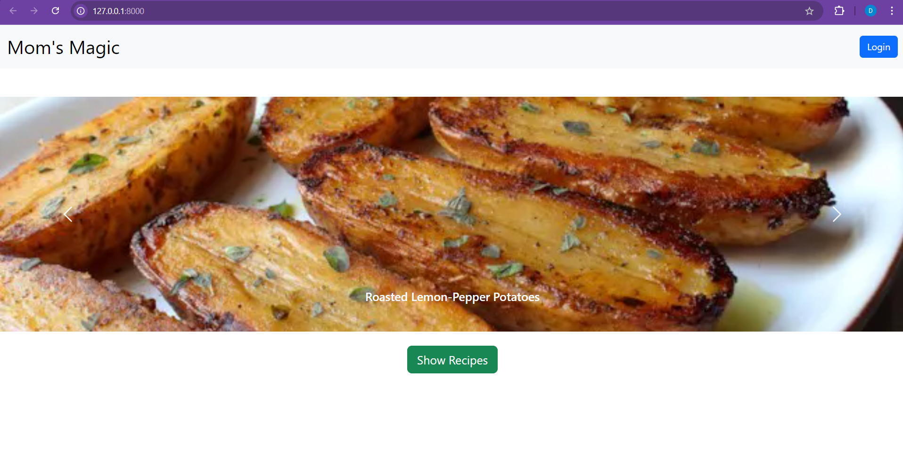
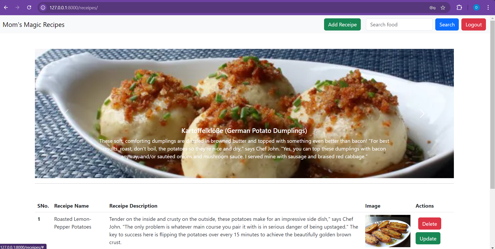

# Mom's Kitchen

Welcome to Mom's Kitchen, a web application where you can browse and add delicious recipes. The application allows users to upload recipes, complete with images and descriptions, and view them in a user-friendly interface.

## Features

- **User Authentication**: Users can register and log in to their accounts.
- **Recipe Management**: Users can add new recipes, view existing ones, and delete them if needed.
- **Image Upload**: Upload images along with recipes.
- **Search Functionality**: Search for recipes by name.

## Technologies Used

- **Django**: A high-level Python web framework.
- **Bootstrap**: For responsive UI design.
- **SQLite3**: A lightweight database for storing recipe data.

## Getting Started

### Prerequisites

Make sure you have the following installed:

- Python 3.x
- pip (Python package manager)
- Django (can be installed via pip)

### Installation

1. **Clone the repository**:

   ```bash
   git clone https://github.com/your_username/moms-kitchen.git
   cd moms-kitchen
   ```

2. **Create a virtual environment** (recommended):

   ```bash
   python -m venv myenv
   source myenv/bin/activate  # On Windows use `myenv\Scripts\activate`
   ```

3. **Install the requirements**:

   ```bash
   pip install -r requirements.txt
   ```

4. **Run migrations**:

   ```bash
   python manage.py makemigrations
   python manage.py migrate
   ```

5. **Run the development server**:

   ```bash
   python manage.py runserver
   ```

6. **Open your browser** and navigate to `http://127.0.0.1:8000/` to access the application.

### Adding Recipes

- After logging in, you can add new recipes using the "Add Recipe" button in the navigation bar.

### Viewing Recipes

- Recipes will be displayed on the main page after logging in.

## Screenshots

*Home page*



*recepie page after login*


